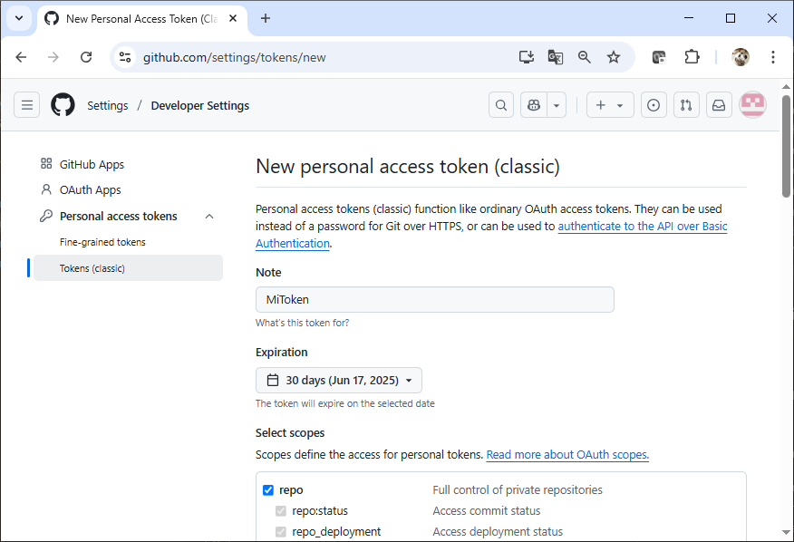
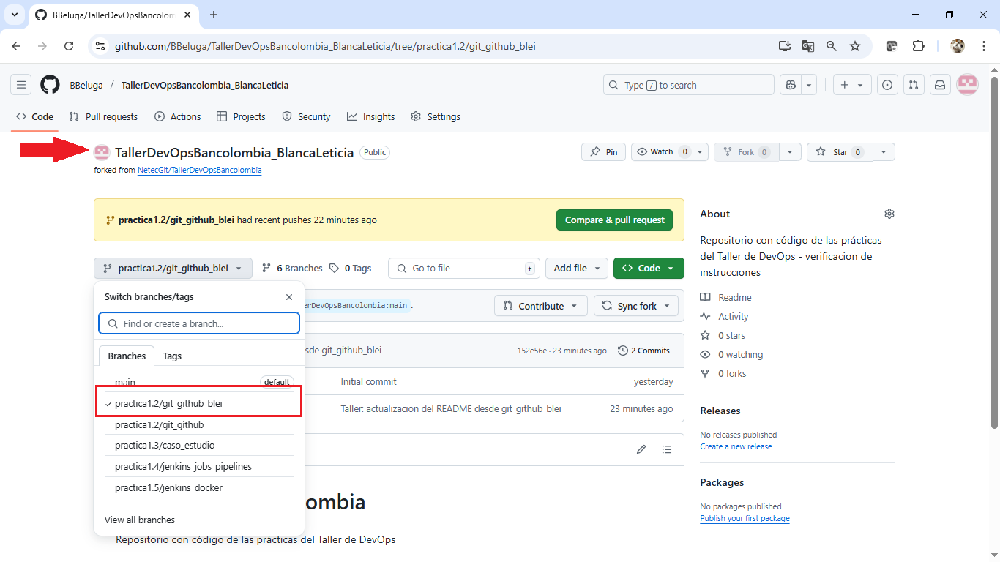

# Práctica 1.2. Git y GitHub

**Repositorio original del Netec(instructor):**
	* `https://github.com/NetecGit/TallerDevOpsBancolombia`
	
**Rama base del repositorio original:**
`practica1.2/git_github`


<br/>

## Objetivo de la práctica:

Al finalizar esta práctica, serás capaz de:

- Configurar tu identidad de Git.
- Clonar y configurar correctamente un fork de un repositorio.
- Crear una nueva rama a partir de una rama base (`practica1.2/git_github`).
- Realizar un cambio en el contenido del repositorio.
- Hacer commit y push de los cambios a tu propio repositorio remoto.

## Duración aproximada:
- 15 minutos.

## Requisitos previos

- Tener Git instalado y funcional.
- Contar con una **cuenta activa en GitHub**.
- Tener iniciada tu sesión en GitHub en el navegador.
- (Opcional) Tener configurado un **token de acceso personal** (classic) para autenticación HTTPS.

## Instrucciones

### 1. Configurar tu identidad de Git

Ejecutar en tu terminal:

```cmd
git config --global user.name "Tu Nombre"
git config --global user.email "tu.correo@ejemplo.com"
```

Verificar:

```cmd
git config --list
```


### 2. Realizar un fork del repositorio original

1. Abrir en el navegador:
	[https://github.com/NetecGit/TallerDevOpsBancolombia](https://github.com/NetecGit/TallerDevOpsBancolombia)

2. Hacer clic en **Fork** (arriba a la derecha).

3. Nombrar tu repositorio como:
   `TallerDevOpsBancolombia-<TU_NOMBRE>`
   Ejemplo: `TallerDevOpsBancolombia-Blanca`


### 3. Clonar tu repositorio forkeado

```cmd
git clone https://github.com/<tu-usuario>/TallerDevOpsBancolombia-<TU_NOMBRE>.git
cd TallerDevOpsBancolombia-<TU_NOMBRE>
```

### 4. Crear una rama local basada en la rama del repositorio original

Verificar que `practica1.2/git_github` esté disponible con:

```cmd
git branch -a
```

Luego cambiarse a ella:

```cmd
git switch practica1.2/git_github  
```

### 5. Crear una nueva rama de trabajo basada en la anterior

```cmd
git checkout -b practica1.2/git_github_<TU_NOMBRE>
```

Ejemplo:

```cmd
git checkout -b practica1.2/git_github_Blanca
```

### 6. Realizar un cambio simple

Editar el archivo `README.md` y agregar al final:

```markdown
## Modificación por <TU_NOMBRE>

Este cambio fue realizado desde la rama practica1.2/git_github_<TU_NOMBRE> para simular un flujo de integración continua.
```

Guardar el archivo.

### 7. Verificar el estado de tu repositorio

```cmd
git status
```
 
### 8. Añadir y confirmar tus cambios

```cmd
git add README.md
git commit -m "Taller DevOps: actualización del README"
```

### 9. Subir tu rama al repositorio remoto (tu fork & tu clone)

```cmd
git push 
```

**Nota:** 
1. Esta última instrucción tipicamente marca un error, pero la propia herramienta te da la instrucción correcta.
2. GitHub ya **no permite autenticación por contraseña** al hacer `push`. Si es la primera vez que haces `push` desde tu terminal, puede solicitar autenticación.
3. Cuando GitHub lo solicite, **usa un Token de Acceso Personal (PAT)** en lugar de tu contraseña.
4. Puedes generar uno desde: [https://github.com/settings/tokens](https://github.com/settings/tokens)
5. Elige el tipo "Personal access token (classic)" con permisos de `repo`.


### 10. Verificar el historial

```cmd
git log

git log --oneline --graph --all
```


### 11. Preguntas de reflexión

1. ¿Por qué es importante usar tu nombre y correo en la configuración de Git?
2. ¿Por qué creamos una rama nueva para trabajar en lugar de modificar directamente la rama del instructor?
3. ¿Qué errores pueden aparecer si no autenticamos correctamente el push?


<br/>

## Resultados esperados

* La siguiente captura de pantalla muestra cómo generar un token de acceso clásico y los permisos que deben seleccionarse.



<br/>

* La siguiente captura de pantalla muestra las ramas disponibles en el repositorio que fue forkeado y posteriormente clonado.



