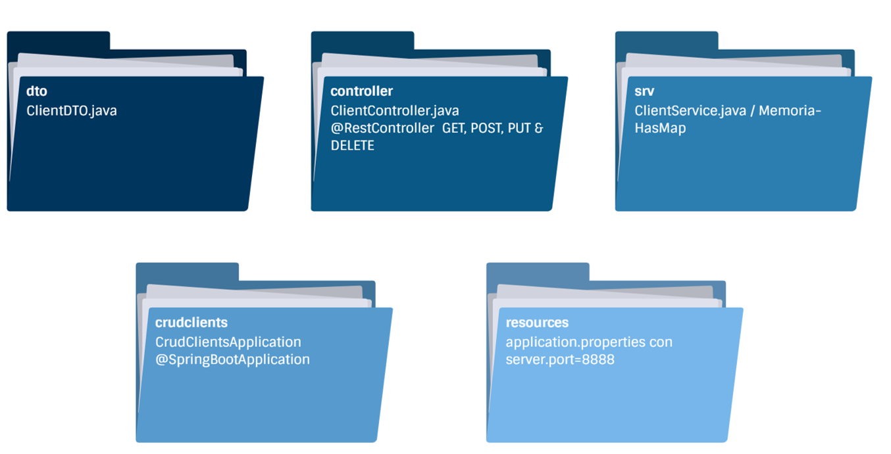
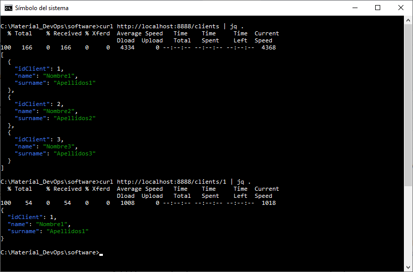
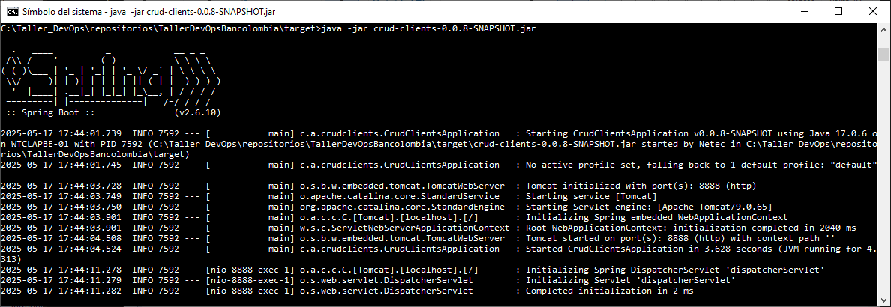

# Práctica 1.3. Caso de estudio – Servicio RESTful en Spring Boot

## Objetivo de la práctica:
Al finalizar esta práctica serás capaz de:
- Analizar, ejecutar y consumir un servicio RESTful de gestión de clientes implementado con Spring Boot, utilizando herramientas de línea de comandos.

## Duración aproximada:
- 15 minutos.

## Objetivo visual:




## Instrucciones

### 1. Clonar el repositorio

   ```bash
   git clone <URL-del-repositorio>
   cd <nombre-del-repositorio>
   ```

### 2. Cambiarse a la rama correspondiente al caso de estudio

   ```bash
   git checkout practica1.3/caso_estudio
   ```

## 3. Analizar la estructura del código
   Revisar la estructura del proyecto y responder las siguientes preguntas:

   * ¿Qué clase contiene el punto de entrada de la aplicación?, ¿Qué anotación la identifica como una aplicación Spring Boot?
   * ¿En qué carpeta se encuentran las clases que exponen los endpoints HTTP?
   * ¿Qué estructura de datos se utiliza para almacenar los clientes en memoria?

## 4. Ejecutar la aplicación
   Asegurarse de tener Maven instalado y ejecutar el siguiente comando:

   ```bash
   mvn spring-boot:run
   ```

## 5. Verificar la configuración
   Revisar el archivo `application.properties` en `src/main/resources` y responder:

   * ¿En qué puerto se expone el servicio?
   * ¿Qué implicaciones tendría cambiar este valor?

## 6. Consumir el servicio REST
   Utilizar `curl` para consumir el servicio. Por ejemplo:

   ```bash
   curl http://localhost:8888/clients | jq .
   curl http://localhost:8888/clients/1 | jq .
   ```

## 7. Analizar la salida

   * ¿Qué campos contiene cada cliente en la respuesta?
   * ¿Cuál es el endpoint base del servicio?


## ❓ Preguntas sobre las anotaciones usadas

1. ¿Cuál es el propósito de la anotación `@PathVariable` en un método manejador de solicitudes y cómo se relaciona con la URL?

2. ¿Qué función cumple `@RequestBody` y en qué situaciones es indispensable para un endpoint `POST` o `PUT`?

<br/>

## Resultado esperado

La siguiente captura de pantalla muestra dos comandos ejecutados desde la terminal utilizando curl para consumir el servicio RESTful del caso de estudio:

**Primera solicitud: curl http://localhost:8888/clients | jq .**
Esta instrucción realiza una petición HTTP GET al endpoint /clients, obteniendo como respuesta un arreglo JSON con todos los clientes registrados en memoria.

**Segunda solicitud: curl http://localhost:8888/clients/1 | jq .**
Esta instrucción realiza una petición GET al endpoint /clients/1, devolviendo un único objeto JSON correspondiente al cliente con idClient igual a 1.

<br/>



### Ejecución alternativa del servicio

Una alternativa para iniciar la aplicación, en lugar de utilizar `mvn spring-boot:run`, es ejecutarla directamente desde el archivo `.jar` generado en el directorio `target` utilizando el siguiente comando:

```bash
java -jar crud-clients-0.0.8-SNAPSHOT.jar
```

La imagen muestra la consola al iniciar correctamente la aplicación **CrudClientsApplication** utilizando Spring Boot. Se puede observar que:

* El servicio se ejecuta sobre **Tomcat embebido**.
* Se ha inicializado exitosamente en el **puerto 8888**.
* No se especifica un *context path*, por lo que el servicio queda accesible directamente en `http://localhost:8888/`.

Esta forma de ejecución es útil cuando se desea distribuir la aplicación como un ejecutable autocontenible.

<br/>


