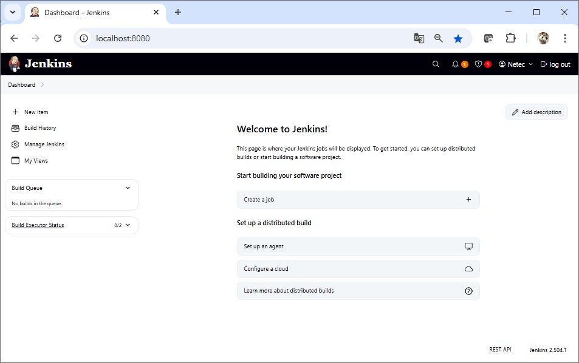
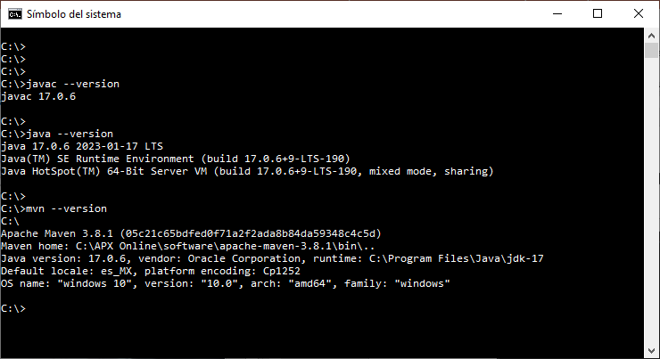
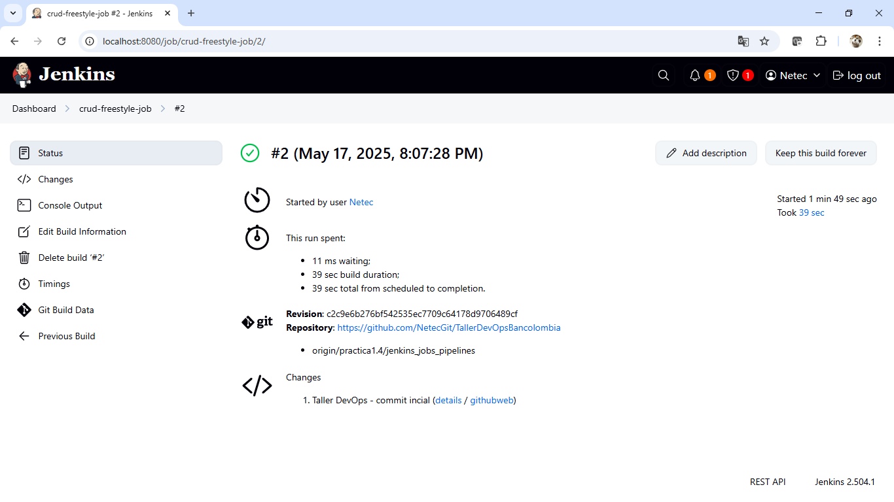
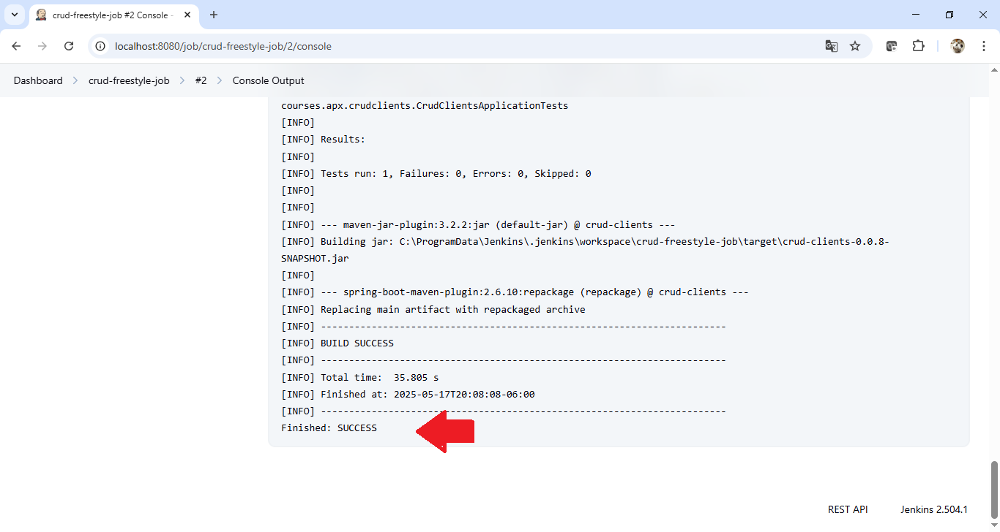
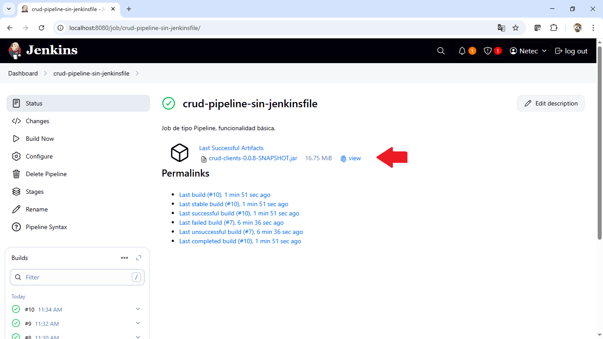
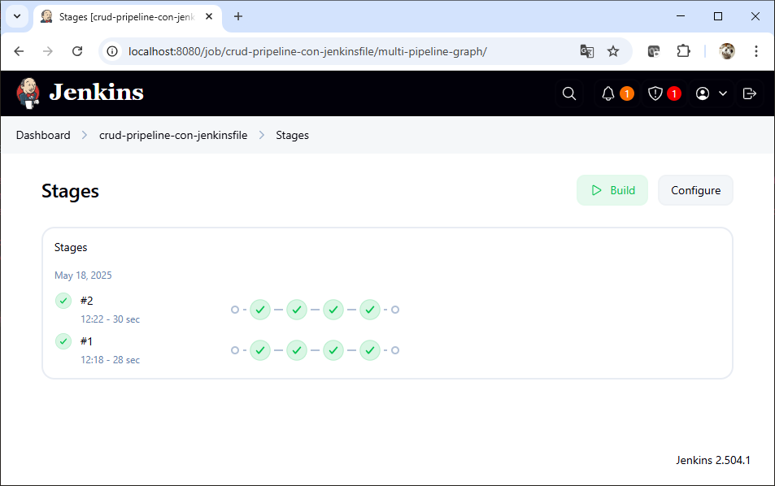

# Práctica 1.4 Jenkins - Jobs & Pipelines


## **Preparativos antes de crear los Jobs**

### 1. Verificar que Jenkins esté funcionando

Desde un navegador, accede a:

```
http://localhost:8080
```

Credenciales predeterminadas:

* **Usuario:** `netec`
* **Contraseña:** `Netec_123`

<br/>

### 2. Verificar software adicional desde consola o terminal

#### Verificar Java:

```bash
java -version
javac --version
```

#### Verificar Maven:

```bash
mvn -version
```

---

## Job 1: **Estilo Libre (Freestyle Job)**

### Objetivo de este Job:

Clonar el repositorio, compilar el proyecto y mostrar el JAR generado.

### Pasos:

1. Ve a **Jenkins Dashboard > New Item**
2. Escribe un nombre como: `crud-freestyle-job`
3. Selecciona **Freestyle project**
4. Clic en **OK**

### Configuración:

* **Sección: Source Code Management**

  * Tipo: `Git`
  * Repositorio: `https://github.com/usuario/mi-repo.git`
  * Branch: `*/practica1.4/jenkins_jobs_pipelines`

* **Sección: Build**

  * Agrega un step de tipo: `Execute Windows batch command` y escribe:

```cmd
echo "Compilando proyecto con Maven"
mvn clean package

echo "Mostrando JAR generado:"
ls -lh target/*.jar
```

* **Guardar y ejecutar el Job**

<br/>


## Resultado Esperado

* La siguiente captura muestra la interfaz principal de Jenkins tras iniciar sesión como el usuario netec.Además, se confirma que Jenkins está correctamente instalado y corriendo en http://localhost:8080.

  

<br/>

* La siguiente captura de pantall muestra como desde la terminal de Windows se confirma que el entorno cuenta con Java JDK 17.0.6 & Apache Maven 3.8.1.  



<br/>

* La siguiente captura muestra el resultado de la ejecución del Job llamado crud-freestyle-job. Podemos observar:

  * Build exitoso (ícono verde)
  * Duración total: 39 segundos
  * Usuario: Netec
  * Código fuente clonado desde el repositorio: https://github.com/NetecGit/TallerDevOpsBancolombia
  * Rama usada: practica1.4/jenkins_jobs_pipelines
  * Último commit registrado como “Taller DevOps - commit inicial”



<br/>

* La siguiente captura valida que el proyecto fue compilado, probado y empaquetado exitosamente desde Jenkins mediante un job de estilo libre que ejecuta comandos Maven. Es una evidencia de que Jenkins, Java y Maven están correctamente configurados y el código fuente del caso de estudio está funcional.



<br/>

---
<br/>


## Job 2: **Pipeline Declarativo desde la GUI (sin Jenkinsfile)**

### Objetivo:

Clonar, compilar, ejecutar pruebas unitarias y empaquetar el caso de estudio usando pasos declarativos en la GUI.


### Pasos:

1. Jenkins Dashboard > **New Item**
2. Nombre: `crud-pipeline-sin-jenkinsfile`
3. Tipo: `Pipeline`
4. Clic en **OK**

### Pipeline Script (en la GUI):

Groovy

```groovy

pipeline {
    agent any

    stages {
        stage('Clonar') {
            steps {
                git branch: 'practica1.4/jenkins_jobs_pipelines',
                    url: 'https://github.com/NetecGit/TallerDevOpsBancolombia'
            }
        }
        stage('Compilar') {
            steps {
                sh 'mvn clean compile'
            }
        }
        stage('Pruebas') {
            steps {
                sh 'mvn test'
            }
        }

        stage('Empaquetar') {
            steps {
                sh 'mvn package'
            }
        }

        stage('Ruta del JAR') {
            steps {
                echo "El archivo JAR generado normalmente se encuentra en: ${env.WORKSPACE}"
                bat "dir ${env.WORKSPACE}\\target\\*.jar"
            }
        }

        stage('Archivar JAR') {
            steps {
                script {
                    // Archiva todos los JARs del directorio target
                    archiveArtifacts artifacts: 'target/*.jar', fingerprint: true

                    // Imprime la ruta completa del JAR
                    def jarPath = "${env.WORKSPACE}\\target"
                    echo 'El archivo JAR se ha archivado exitosamente.'
                    echo 'Ubicación dentro del workspace de Jenkins:'
                    bat "dir \"${jarPath}\\*.jar\""
                }
            }
        }
    }
}


```

* **Guardar y Ejecutar el pipeline**

<br/>

## Resultado Esperado

* La siguiente captura de pantalla muestra el pipeline crud-pipeline-sin-jenkinsfile, el cual fue configurado directamente desde la interfaz gráfica de Jenkins.
* Es un Job de tipo Pipeline, lo que permite definir múltiples etapas como Clonar, Compilar, Pruebas, directamente desde el editor gráfico de Jenkins.
* Este archivo JAR fue construido correctamente con Maven y almacenado como artefacto del job.
* El enlace "view" permite ver o descargar el artefacto directamente desde Jenkins.

<br/>



<br/>
---
<br/>

## Job 3: **Pipeline con Jenkinsfile**

### Objetivo:

Ejecutar el mismo pipeline anterior pero basado en un `Jenkinsfile` dentro del repositorio.

### Pasos:

1. Jenkins Dashboard > **New Item**
2. Nombre: `crud-pipeline-con-jenkinsfile`
3. Tipo: `Pipeline`
4. Clic en **OK**

### Configuración:

* En **Pipeline > Definition** selecciona: `Pipeline script from SCM`
* SCM: `Git`
* Repositorio: `https://github.com/NetecGit/TallerDevOpsBancolombia`
* Branch: `practica1.4/jenkins_jobs_pipelines`
* Script Path: `Jenkinsfile`

### Contenido sugerido del `Jenkinsfile`:

Groovy

```groovy
pipeline {
    agent any

    stages {
        stage('Clonar') {
            steps {
                checkout scm
            }
        }
        stage('Compilar') {
            steps {
                sh 'mvn clean compile'
            }
        }
        stage('Pruebas') {
            steps {
                sh 'mvn test'
            }
        }
    }
}
```


* **Guardar y Ejecutar el pipeline**

<br/>

## Verificación de resultados

Para todos los jobs, valida:

* En la consola de Jenkins, salida de consola (`Console Output`)
* Archivos generados (`target/`)
* Estado del build (éxito o fallido)

<br/>


## Resultado Esperado

La captura de pantalla siguiente es la vista moderna de Graph View en Jenkins 2.504.1, muestra los resultados de las ejecuciones del pipeline:


