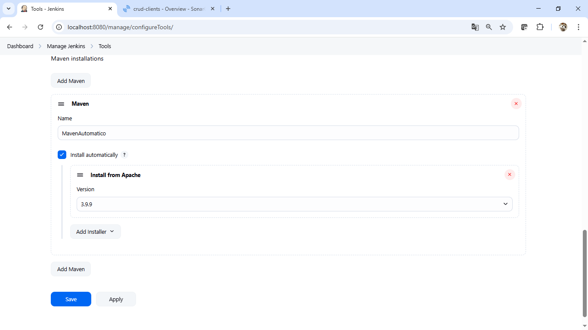

# Práctica 2.1 – Jenkins Pipeline y SonarQube 

## Objetivo de la práctica:
Al finalizar esta práctica serás capaz de:

- Configurar y ejecutar un **Jenkins Pipeline** que:
  - Clone un repositorio Git.
  - Compile el proyecto con Maven.
  - Ejecute análisis de código estático con **SonarQube**.

## Duración aproximada:
- 25 minutos.
  
## Requisitos previos

### 1. **Jenkins funcionando**
### 2. **SonarQube ejecutándose localmente**

   * Por ejemplo, desde:
     `C:\software\sonarqube-25.5.0.107428\bin\windows-x86-64\StartSonar.bat`
	 
### 3. **Token de usuario de SonarQube**

### 4. Jenkins debe tener:

   * Plugin **SonarQube Scanner for Jenkins**.
   * Maven configurado en `Global Tool Configuration`.

<br/>

## Instrucciones

### Paso 1: Configurar SonarQube en Jenkins

### A. Servidor SonarQube

1. Ir a: `Manage Jenkins > Configure System`.
2. Buscar la sección **SonarQube servers**.
3. Hacer clic en **Add SonarQube**.

   * **Name**: `SonarQube`
   * **URL**: `http://localhost:9000`
   * Agrega el **token de usuario** como credencial:

     * Tipo: `Secret text`
     * ID sugerido: `sonarqube-token`
4. Marcar: **"Environment variables will be injected..."**
5. Guardar.

<br/>

### B. Herramientas 

1. Ir a: `Manage Jenkins > Global Tool Configuration`
2. En **Maven**, agrega:

   * **Name**: `MavenAutomatico`
   * Marca “Install automatically” u opcionalmente da la ruta si ya lo tienes instalado.


<br/>

## Paso 2: Generar un token de usuario en SonarQube

1. Ir a `http://localhost:9000`
2. Iniciar sesión (admin / Netec_123abc)
3. Menú superior derecho → **My Account > Security**
4. En *Generate Tokens*:

   * Nombre: `jenkins-token`
   * Click en **Generate**
   * Copia el token → lo usarás como credencial en Jenkins


<br/>

## Paso 3: Crear un nuevo Job tipo *Pipeline*

1. En Jenkins, hacer clic en **“New Item”**.
2. Nombre del proyecto: `pipeline-sonarqube`
3. Seleccionar: `Pipeline`
4. Hacer clic en **OK**.


<br/>

## Paso 4: Definir el Pipeline script

En la pestaña **Pipeline**, elegir:

* Definition: **Pipeline script**
* Script: copiar y pegar el siguiente bloque Groovy:

```groovy
pipeline {
  agent any

  tools {
    maven 'MavenAutomatico' // Debe coincidir con el nombre definido en Jenkins si es que lo cambiaste
  }

  environment {
    SONAR_TOKEN = credentials('sonarqube-token') // ID del token en Jenkins, debe coincider con el dado en el Paso 1.
  }

  stages {
    stage('Clonar código') {
      steps {
        git url: 'https://github.com/usuario/repositorio.git', branch: 'main'
      }
    }

    stage('Compilar') {
      steps {
        sh 'mvn clean compile'
      }
    }

    stage('Análisis SonarQube') {
      steps {
        withSonarQubeEnv('SonarQube') {
          sh """
            mvn sonar:sonar \
              -Dsonar.projectKey=mi-proyecto \
              -Dsonar.token=${SONAR_TOKEN} \
              -Dsonar.sources=src/main/java \
              -Dsonar.tests=src/test/java \
              -Dsonar.java.binaries=target
          """
        }
      }
    }
  }
}
```

### Notas:

* Reemplazar:

	* `https://github.com/usuario/repositorio.git` por la URL de tu fork
	* `main` por la rama adecuada si estás usando `practica2.1/jenkins_sonarqube`
	* `mi-proyecto` por un identificador único


<br/>

### Paso 5: Ejecutar el Pipeline

1. Guardar el Job
2. Hacer clic en **Build Now**
3. Ir a **Console Output**

   * Buscar la línea:

     ```
     ANALYSIS SUCCESSFUL, you can browse http://localhost:9000/dashboard?id=mi-proyecto
     ```


## Resultado esperado

* Captura de pantalla que muestra la salida exitosa al iniciar el servidor de SonarQube.

  

<br/>

* Captura que muestra la instalación del plugin **SonarQube Scanner for Jenkins**:

  
  
  
 
 <br/>

* Captura que muestra la configuración del servidor **SonarQube** en Jenkins:

  

<br/>

* Captura que muestra la configuración de **Maven** en Jenkins:

  


<br/>

* Captura de la **salida de la consola** del pipeline `pipeline-sonarqube`:

  


<br/>

* Captura que muestra el **reporte generado por SonarQube**:

  

<br/>

* Captura que muestra la **ejecución exitosa del pipeline** y el ícono de acceso al reporte de SonarQube:

  
