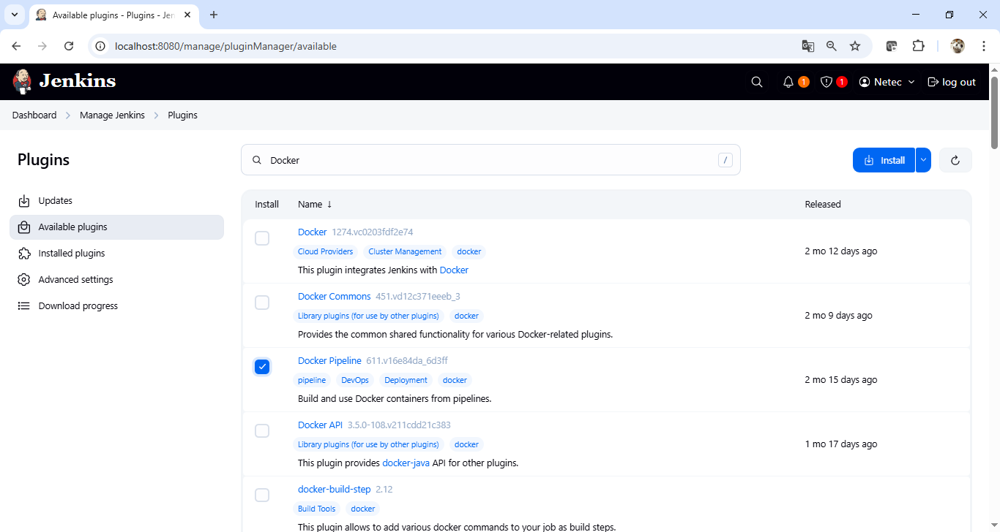
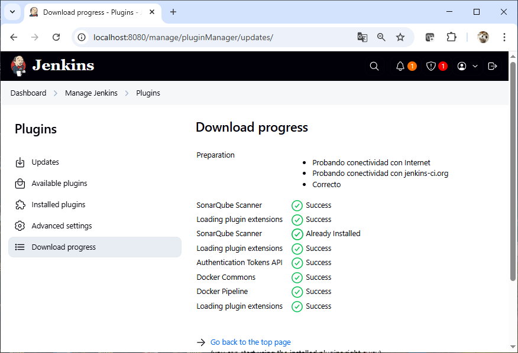
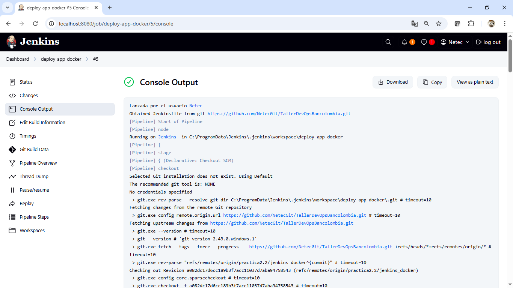
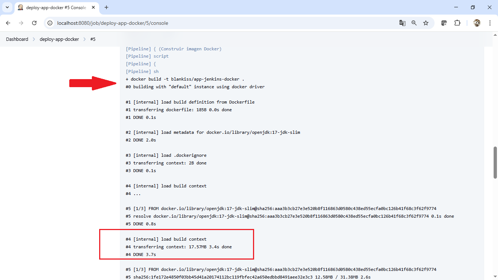
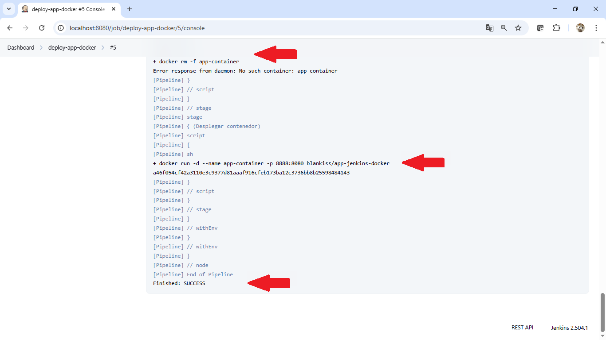
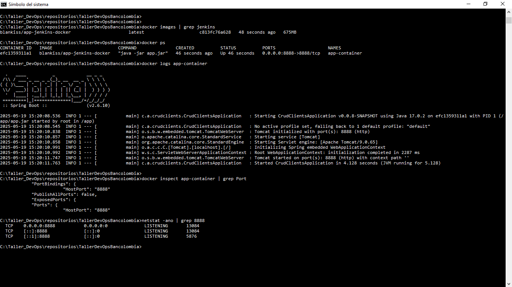
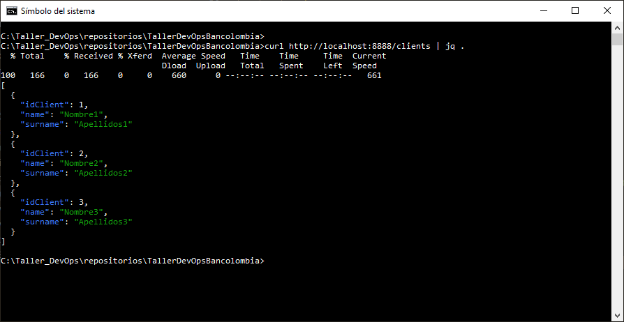

# Práctica 2.2: Jenkins & Docker

## Objetivo

Automatizar el proceso de despliegue de una aplicación contenida en Docker mediante un Pipeline de Jenkins, a partir del código fuente alojado en GitHub (rama `practica2.2/jenkins-docker`).


## **Requisitos previos**

1. Jenkins instalado y en ejecución.
2. Docker instalado en la misma máquina que Jenkins.
3. En caso de Unix/Linux, el usuario de Jenkins debe tener permisos para ejecutar Docker (miembro del grupo `docker`).
4. El repositorio del caso de estudio debe estar accesible (en GitHub, rama: `practica2.2/jenkins-docker`).
5. Credenciales configuradas en Jenkins para acceder a GitHub si el repositorio es privado.


## **Plugins necesarios en Jenkins**

Instala los siguientes plugins desde el panel de administración de Jenkins (`Administrar Jenkins > Administrar Plugins`):

1. **Docker Pipeline**
2. **Git plugin**
3. **Pipeline**
4. **Credentials Binding Plugin**

<br/>

> En la máquina virtual proporcionada para el Taller DevOps, únicamente resta instalar el primer plugin.

<br/>


## **Instrucciones**

### 1. **Agregar credencial para GitHub (si es privado)**

* Tipo: Username with password (token personal como password)
* ID: `github-credentials`

<br/>

### **2. Crear Dockerfile en la rama `practica2.2/jenkins-docker`**

Agrega un `Dockerfile` para contener la aplicación.  


```Dockerfile
FROM openjdk:17-jdk-slim
WORKDIR /app
COPY target/app.jar app.jar
EXPOSE 8080
ENTRYPOINT ["java", "-jar", "app.jar"]
```

<br/>

### **3. Crear Jenkinsfile en la misma rama**

Ejemplo de Jenkinsfile que construye y despliega el contenedor:


```groovy
pipeline {
    agent any

    environment {
        IMAGE_NAME = 'blankiss/app-jenkins-docker'
        CONTAINER_NAME = 'app-container'
        PORT = '8888'
    }

    stages {
        stage('Clonar repositorio') {
            steps {
                git branch: 'practica2.2/jenkins_docker',
                    url: 'https://github.com/NetecGit/TallerDevOpsBancolombia.git',
                    credentialsId: 'github-credentials'
            }
        }

        stage('Compilar aplicacion') {
            steps {
                sh 'mvn clean package -DskipTests'
            }
        }

        stage('Construir imagen Docker') {
            steps {
                script {
                    sh 'docker build -t $IMAGE_NAME .'
                }
            }
        }

        stage('Eliminar contenedor anterior') {
            steps {
                script {
                    sh 'docker rm -f $CONTAINER_NAME || true'
                }
            }
        }

        stage('Desplegar contenedor') {
            steps {
                script {
                    sh 'docker run -d --name $CONTAINER_NAME -p $PORT:8888 $IMAGE_NAME'
                }
            }
        }
    }
}

```

> Reemplaza `<nombre-usuario>/<app-jenkins-docker>` y la URL del repo con los valores reales.


<br/>

### **4. Crear un nuevo Job tipo Pipeline**

1. Entra al panel principal de Jenkins.
2. Haz clic en **"Nuevo Item"**.
3. Asigna un nombre, por ejemplo: `deploy-app-docker`.
4. Selecciona la opción **"Pipeline"** y presiona **OK**.


<br/>

### **5. Configurar el Job**

#### Sección **General**

* (Opcional) Marca la casilla **"Este proyecto está parametrizado"** si deseas parámetros como nombre del contenedor, puerto, etc.

#### Sección **Gestión de código fuente**

No es necesario configurar aquí el repositorio si lo defines en el `Jenkinsfile`. Deja esta sección vacía.

#### Sección **Pipeline**

* **Definición:** *Pipeline desde SCM*.
* **SCM:** *Git*.
* **Repositorio:**
  `https://github.com/usuario/repositorio.git` (reemplaza con el tuyo).
* **Credenciales:** Selecciona las previamente registradas (por ejemplo: `github-credentials`).
* **Branch:** `practica2.2/jenkins-docker`.
* **Script Path:** `Jenkinsfile` (si está en la raíz; cambia si está en otra carpeta).

<br/>

### **6. Guardar y Ejecutar**

1. Haz clic en **Guardar**.
2. Desde el dashboard del job, haz clic en **"Construir ahora"**.
3. Observa la consola para verificar:

   * Clonación del repo.
   * Compilación (`mvn package`).
   * Construcción de la imagen Docker.
   * Eliminación del contenedor anterior.
   * Despliegue de la nueva versión de la app.


<br/>

### **7. Verifica el despliegue**

* Ejecuta: `docker ps` en el servidor para confirmar que el contenedor está corriendo.
* Abre el navegador en `http://localhost:8888` (o el puerto definido) para acceder a la app.


<br/>

## Resultado Esperado 


<br/>

* Captura de pantalla que muestra la lista de plugins relacionados con Docker. En esta práctica se utiliza el plugin Docker Pipeline (Build and use Docker containers from pipelines).



<br/>

* Captura de pantalla que muestra el detalle de la instalación del plugin Docker Pipeline.




<br/>

* Captura de pantalla que muestra el inicio del Job de Jenkins



<br/>

* Captura de pantalla que muestra cómo, desde la consola del Job, se inicia la construcción de la imagen Docker utilizando el Dockerfile ubicado en la raíz del repositorio.




<br/>

* Captura que muestra la **consola de ejecución de un Pipeline en Jenkins**, correspondiente al Job llamado `deploy-app-docker`, ejecución #5. Se observan tres eventos destacados:

1. Un intento de eliminar un contenedor Docker llamado `app-container`, que **no existía previamente** (`No such container: app-container`).
2. La ejecución exitosa del comando `docker run`, que **lanza un nuevo contenedor** a partir de la imagen `blankiss/app-jenkins-docker`, mapeando el puerto **8888 del host al 8080 del contenedor**.
3. El pipeline finaliza con el estado **"SUCCESS"**, indicando que **el despliegue fue exitoso**.




<br/>

* Captura que muestra una terminal de Windows en la que se verifica el estado de ejecución de un contenedor Docker con una aplicación Spring Boot. A continuación se describen los elementos clave:

1. **Listado de imágenes Docker**: Se confirma la existencia de la imagen `blankiss/app-jenkins-docker`, construida recientemente.
2. **Contenedor en ejecución**: El contenedor `app-container` se encuentra activo y ejecutando el comando `java -jar app.jar`. Está escuchando en el puerto **8888**.
3. **Salida de logs del contenedor**: Se observa el arranque exitoso de una aplicación Spring Boot (`CrudClientsApplication`), que utiliza Tomcat y se inicia en el puerto **8888**, sin errores.
4. **Inspección del contenedor**: Se valida que el puerto expuesto y mapeado es el **8888**, tanto internamente como hacia el host.
5. **Verificación con `netstat`**: Se comprueba que el sistema operativo está escuchando en el puerto **8888**, lo cual indica que el servicio está disponible para recibir conexiones externas.





<br/>

* Captura de pantalla que muestra la respuesta exitosa del endpoint /clients, indicando que la aplicación desplegada con Docker está funcionando correctamente y devolviendo datos en formato JSON.




